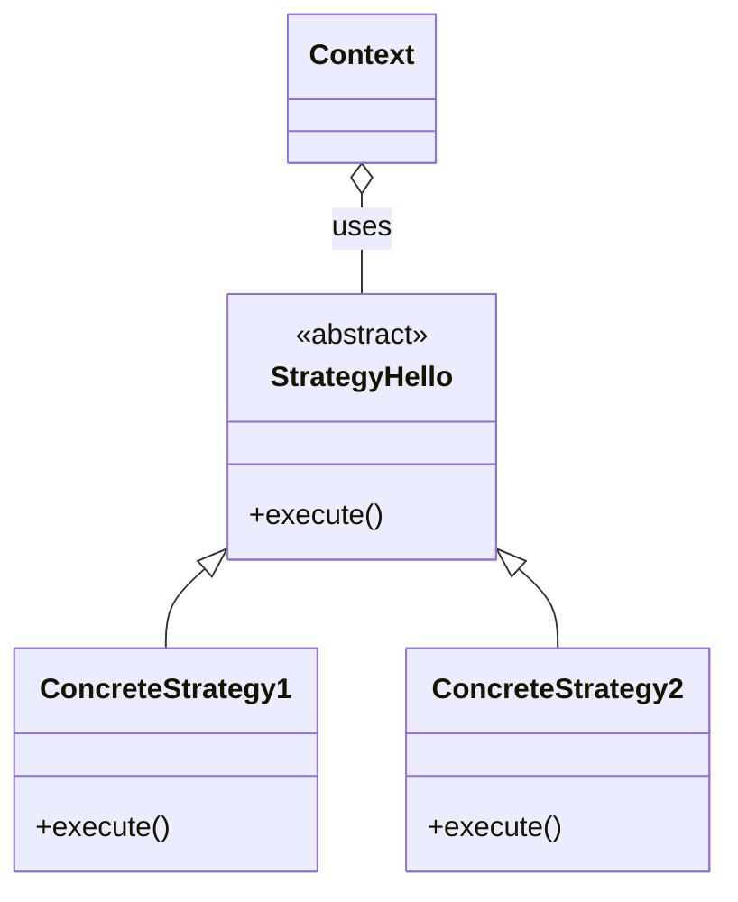

# To Do List

## Learn To Use Markdown diagram tool: Mermaid

```mermaid
classDiagram
    class Context
    Context o-- StrategyHello : uses
    class StrategyHello {
        <<abstract>>
        +execute()
    }
    StrategyHello <|-- ConcreteStrategy1
    StrategyHello <|-- ConcreteStrategy2
    ConcreteStrategy1: +execute()
    ConcreteStrategy2: +execute()
```
